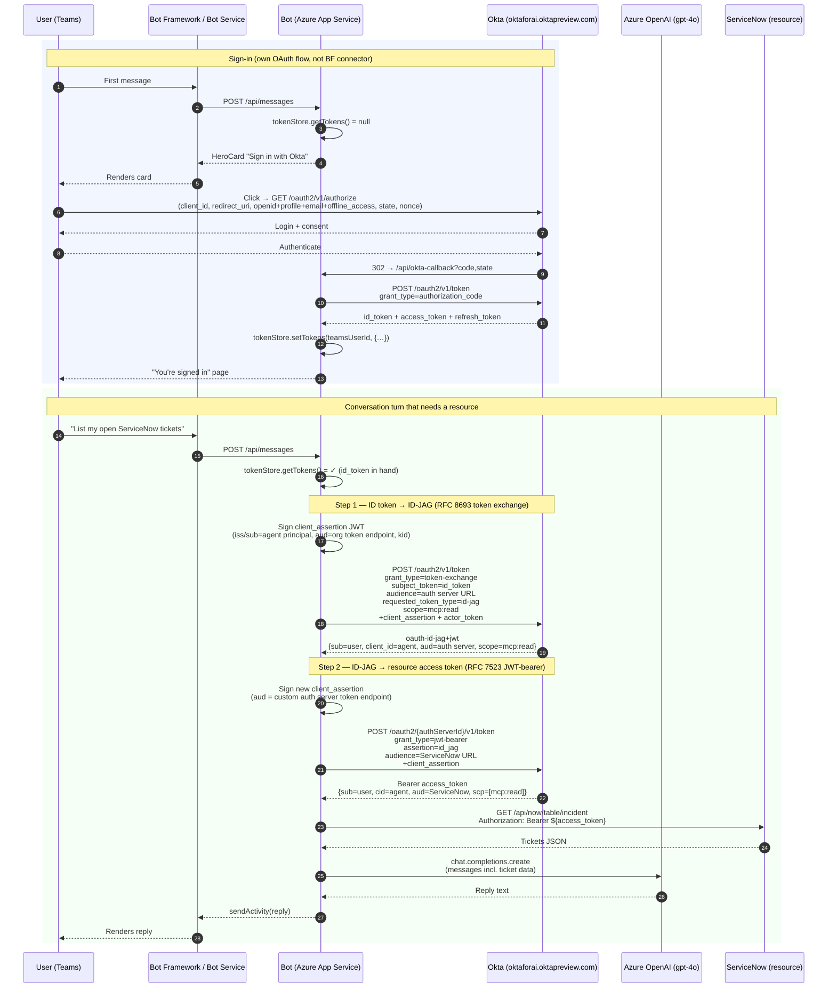

# Foundry Teams Bot — Okta as Control Plane

A Microsoft Teams bot, backed by Azure AI Foundry / Azure OpenAI (gpt-4o), gated behind Okta OAuth sign-in, with full **Cross-App Access (XAA / ID-JAG)** plumbing for issuing scoped, audited resource tokens that carry both the human user (`sub`) and the agent workload (`cid`) in a single Bearer.

The result: a chat agent in Teams whose every action is policy-controlled by Okta — from "is this user allowed to talk to the agent?" all the way to "is this agent allowed to call ServiceNow on this user's behalf with this scope?".

## Sequence diagram — full flow



The two-leg XAA chain is the demo's core. Each leg authenticates the agent itself via a JWT signed with the AI Agent's private key (so the agent is its own first-class identity in Okta, not just a client secret tied to a user app), and Okta enforces policy at every hop via the AI Agent's **Resource Connections**.

## Architecture (block view)

```
                       +--------------------+
  user in Teams ─────► |  Bot Framework /   | ─── messaging endpoint ───+
                       |   Bot Service      |                            │
                       +--------------------+                            │
                              │                                          │
                       OAuth card (sign in)                              │
                              ▼                                          │
                       +--------------------+                            │
                       |        Okta        |  OIDC + RFC 8693 + RFC 7523│
                       |  (identity +       |   (id_token → id-jag →     │
                       |   policy + XAA)    |    resource access token)  │
                       +--------------------+                            │
                              ▲                                          │
                          tokens                                         │
                              │                                          ▼
                       +--------------------+        +-----------------------------+
                       | Azure App Service  | ─────► |  Azure OpenAI (gpt-4o)      |
                       | (Node.js bot)      |        +-----------------------------+
                       +--------------------+
                              │
                       Bearer access token
                              ▼
                       +--------------------+
                       |  ServiceNow / MCP  |
                       |   (resource API)   |
                       +--------------------+
```

- **Identity control plane**: Okta. Two distinct Okta identities ride together — the user's OIDC sign-in identity (`Foundry Agent App`) and the agent's machine identity (`Foundry Agent` AI-Agent object), bridged via Cross-App Access policy.
- **Sign-in surface**: HeroCard openUrl button to Okta's OIDC authorize endpoint. The bot hosts its own `/api/okta-callback` to exchange code for tokens — no Bot Framework OAuth Connection required.
- **Agent runtime**: Azure OpenAI (gpt-4o), called from the bot. Optionally swap for Azure AI Foundry's agent SDK once schema-stable.

## Slash commands

| Command | Effect |
|---|---|
| `/whoami` | Decode the cached Okta ID token; show the user's email/sub. |
| `/logout` | Clear the bot's local token cache for this user. Okta browser session unaffected. |
| `/logout-okta` | Clear local cache **and** present a button to hit Okta's `/oauth2/v1/logout` (so next sign-in shows the actual login page — useful for live demos). |
| `/testjag` | Run leg 1 of the XAA chain (ID token → ID-JAG) and print the response + decoded claims. |
| `/testresource` | Run both legs (ID token → ID-JAG → resource access token) and print each response with decoded claims. |

Any other text triggers the regular gpt-4o conversation flow (with per-conversation history).

## Repository layout

```
.
├── index.js                # Restify server: /api/messages + /api/okta-callback
├── bot.js                  # TeamsActivityHandler: token gating, /commands, gpt-4o, XAA chain
├── oktaTokenStore.js       # In-memory state + token cache (per Teams user)
├── build-manifest.js       # Pure-Node script that generates Teams app icons (PNG)
├── manifest/
│   ├── manifest.json       # Teams app manifest (v1.17)
│   ├── color.png           # 192×192 color icon (generated)
│   └── outline.png         # 32×32 outline icon (generated)
├── package.json
├── .env.sample             # Template — copy to .env for local use
├── README.md               # You're here
└── DEPLOY.md               # Step-by-step setup walkthrough
```

## Prerequisites

- **Azure subscription** with permission to create Bot Service, App Service, and Azure OpenAI resources.
- **Entra tenant with Teams licensing** (Microsoft 365 Business Basic / E-series). MSA-owned "Default Directory" tenants cannot host Teams for Work.
- **Okta org** (Okta Preview is fine). Ability to create OIDC apps, AI Agent objects, custom Authorization Servers, and Resource Connections.
- **Node.js 20+** locally for builds.

## Configuration (App Service settings)

| Variable | Description |
|---|---|
| `MicrosoftAppType` | `SingleTenant` or `MultiTenant`. |
| `MicrosoftAppId` / `MicrosoftAppPassword` / `MicrosoftAppTenantId` | Bot's Entra app registration (created with Azure Bot resource). |
| `AZURE_OPENAI_ENDPOINT` / `AZURE_OPENAI_API_KEY` / `AZURE_OPENAI_DEPLOYMENT` / `AZURE_OPENAI_API_VERSION` | gpt-4o deployment. |
| `OKTA_DOMAIN` | e.g. `https://oktaforai.oktapreview.com`. |
| `OKTA_OIDC_CLIENT_ID` / `OKTA_OIDC_CLIENT_SECRET` | The OIDC web app in Okta (user sign-in). |
| `OKTA_REDIRECT_URI` | `https://<app-name>.azurewebsites.net/api/okta-callback` (must also be registered on the OIDC app). |
| `OKTA_AUTHORIZATION_SERVER_ID` | Custom auth server hosting XAA policies. |
| `OKTA_AGENT_PRINCIPAL_ID` | The AI Agent object's ID (used as `iss`/`sub` of client assertions). |
| `OKTA_AGENT_PRIVATE_JWK` | The AI Agent's private key (full JWK as JSON). Generated once in Okta. |
| `OKTA_REQUESTED_SCOPE` | Default `mcp:read`. |
| `OKTA_RESOURCE_AUDIENCE` | The resource server URI (e.g. `https://oktademo.mcp.servicenow.com`). |

## Build

```bash
npm install
node build-manifest.js
zip -j teams-app-package.zip manifest/manifest.json manifest/color.png manifest/outline.png
zip -r foundry-teams-bot.zip . -x 'node_modules/*' '.env' '.git/*' 'manifest/*' '*.zip' 'build-manifest.js'
```

## Deploy

See [DEPLOY.md](DEPLOY.md) for the full end-to-end walkthrough — Azure resources, Okta OIDC + AI Agent + custom auth server + Resource Connection, Teams sideload, and App Settings.

## Known limitations (demo scope)

- **Tokens live in process memory** (`oktaTokenStore.js`). Every App Service restart wipes them and forces re-auth. Production should swap to Cosmos / Storage.
- **API key auth** to Azure OpenAI rather than managed identity. Rotate / migrate before going beyond a demo.
- **No actual ServiceNow call yet** — `/testresource` produces a valid Bearer; downstream API call is the next iteration.
- **Single-tenant bot.** Runs in one Entra tenant.
- **No step-up auth.** Demo relies on Okta's baseline policy for the OIDC app.

## Built with

- Bot Framework SDK v4 (Node.js) — TeamsActivityHandler + CloudAdapter
- `restify` — HTTP server
- `openai` — Azure OpenAI client
- `jose` — JWT signing for client assertions and actor tokens
- Okta — OIDC, custom Authorization Servers, AI Agents, Cross-App Access (ID-JAG)
