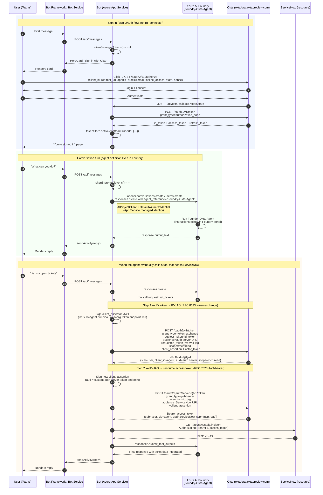

# Foundry Teams Bot — Okta as Control Plane

> ⚠️ **Demonstration code only — not production-ready.**
>
> This repository is a working reference architecture for showing how Okta can govern an AI agent's identity end-to-end across Microsoft Teams, Azure AI Foundry, and a downstream resource (ServiceNow). It is **not** hardened for production use. It cuts corners around state durability, secret management, multi-user concurrency, error handling, observability, and supply-chain security to keep the demo readable and easy to walk through. Do not deploy this verbatim against real users or sensitive data — see the [Known limitations](#known-limitations-demo-scope) section before adapting it.

A Microsoft Teams bot fronting an **Azure AI Foundry agent**, gated behind Okta OAuth sign-in, with full **Cross-App Access (XAA / ID-JAG)** plumbing for issuing scoped, audited resource tokens that carry both the human user (`sub`) and the agent workload (`cid`) in a single Bearer.

**Architectural intent**: the *agent's brain* (instructions, model, tools, behavior) lives entirely in **Azure AI Foundry** — editable from the Foundry portal, no redeploy required. The *bot* is a deliberately thin relay whose only jobs are:

1. Bridge Teams ↔ Foundry agent.
2. Be the **Okta policy enforcement boundary** — sign the user in via Okta, then mint scoped resource tokens for the agent via Cross-App Access.

This separation is the demo's punchline: **Foundry runs the agent; the bot is the Okta control plane that decides what the agent is allowed to do, on whose behalf, and with what credentials.**

## Sequence diagram — full flow



The XAA chain (orange band) is wired but currently exposed via `/testjag` and `/testresource` slash commands; tool-call interception will hook the same chain into normal conversation turns once tools are registered with the Foundry agent.

## Architecture (block view)

```
                       +--------------------+
  user in Teams ─────► |  Bot Framework /   | ─── messaging endpoint ───+
                       |   Bot Service      |                            │
                       +--------------------+                            │
                              │                                          │
                       OAuth card (sign in)                              │
                              ▼                                          │
                       +--------------------+                            │
                       |        Okta        |  OIDC + RFC 8693 + RFC 7523│
                       |  (identity +       |   (id_token → id-jag →     │
                       |   policy + XAA)    |    resource access token)  │
                       +--------------------+                            │
                              ▲                                          │
                          tokens                                         │
                              │                                          ▼
                       +--------------------+        +-----------------------------+
                       | Azure App Service  | ─────► |  Azure AI Foundry           |
                       |  (Node.js bot —    |  MI    |  Foundry-Okta-Agent         |
                       |   thin relay only) |        |  (instructions, model,      |
                       +--------------------+        |   tools — edit in portal)   |
                              │                      +-----------------------------+
                       Bearer access token
                              ▼
                       +--------------------+
                       |  ServiceNow / MCP  |
                       |   (resource API)   |
                       +--------------------+
```

- **Identity control plane**: Okta. Two distinct Okta identities ride together — the user's OIDC sign-in identity (`Foundry Agent App`) and the agent's machine identity (`Foundry Agent` AI-Agent object), bridged via Cross-App Access policy on a custom Authorization Server.
- **Sign-in surface**: HeroCard openUrl button to Okta's OIDC authorize endpoint. The bot hosts its own `/api/okta-callback` to exchange code for tokens — no Bot Framework OAuth Connection involved.
- **Agent runtime**: Azure AI Foundry. The bot calls the agent by name via `responses.create({conversation}, {body: {agent_reference: {type: 'agent_reference', name}}})`. Agent instructions, model, and tools are edited in the Foundry portal.
- **Bot ↔ Foundry auth**: App Service system-assigned managed identity, granted `Azure AI User` on the Foundry resource. No API keys.

## Slash commands

| Command | Effect |
|---|---|
| `/whoami` | Decode the cached Okta ID token; show the user's email/sub. |
| `/logout` | Clear the bot's local token cache for this user. Okta browser session unaffected. |
| `/logout-okta` | Clear local cache **and** present a button to hit Okta's `/oauth2/v1/logout` (next sign-in shows the actual Okta login page). |
| `/testjag` | Run leg 1 of the XAA chain (ID token → ID-JAG) and print the response + decoded claims. |
| `/testresource` | Run both legs (ID token → ID-JAG → resource access token) and print each response with decoded claims. |

Any other text routes to the Foundry agent for a normal conversation turn.

## Repository layout

```
.
├── index.js                # Restify server: /api/messages + /api/okta-callback
├── bot.js                  # TeamsActivityHandler: token gating, /commands, Foundry relay
├── oktaTokenStore.js       # In-memory state + token cache (per Teams user)
├── build-manifest.js       # Pure-Node script that generates Teams app icons (PNG)
├── manifest/
│   ├── manifest.json       # Teams app manifest (v1.17)
│   ├── color.png           # 192×192 color icon (generated)
│   └── outline.png         # 32×32 outline icon (generated)
├── package.json
├── .env.sample             # Template — copy to .env for local use
├── README.md               # You're here
└── DEPLOY.md               # Step-by-step setup walkthrough
```

## Prerequisites

- **Azure subscription** with permission to create Bot Service, App Service, and Azure AI Foundry resources.
- **Entra tenant with Teams licensing** (Microsoft 365 Business Basic / E-series). MSA-owned "Default Directory" tenants cannot host Teams for Work.
- **Okta org** (Okta Preview is fine). Ability to create OIDC apps, AI Agent objects, custom Authorization Servers, and Resource Connections.
- **Node.js 20+** locally for builds.

## Configuration (App Service settings)

| Variable | Description |
|---|---|
| `MicrosoftAppType` | `SingleTenant` or `MultiTenant`. |
| `MicrosoftAppId` / `MicrosoftAppPassword` / `MicrosoftAppTenantId` | Bot's Entra app registration (created with Azure Bot resource). |
| `FOUNDRY_PROJECT_ENDPOINT` | e.g. `https://<resource>.services.ai.azure.com/api/projects/<project>`. |
| `FOUNDRY_AGENT_NAME` | Name of the agent in Foundry, e.g. `Foundry-Okta-Agent`. Used as `agent_reference.name`. |
| `OKTA_DOMAIN` | e.g. `https://oktaforai.oktapreview.com`. |
| `OKTA_OIDC_CLIENT_ID` / `OKTA_OIDC_CLIENT_SECRET` | The OIDC web app in Okta (user sign-in). |
| `OKTA_REDIRECT_URI` | `https://<app-name>.azurewebsites.net/api/okta-callback` (also registered on the OIDC app). |
| `OKTA_AUTHORIZATION_SERVER_ID` | Custom auth server hosting XAA policies. |
| `OKTA_AGENT_PRINCIPAL_ID` | The AI Agent object's ID (used as `iss`/`sub` of client assertions). |
| `OKTA_AGENT_PRIVATE_JWK` | The AI Agent's private key (full JWK as JSON). Generated once in Okta. |
| `OKTA_REQUESTED_SCOPE` | Default `mcp:read`. |
| `OKTA_RESOURCE_AUDIENCE` | The resource server URI (e.g. `https://oktademo.mcp.servicenow.com`). |

The App Service must have **system-assigned managed identity enabled** with `Azure AI User` role on the Foundry resource — no API keys for the agent path.

## Build

```bash
npm install
node build-manifest.js
zip -j teams-app-package.zip manifest/manifest.json manifest/color.png manifest/outline.png
zip -r foundry-teams-bot.zip . -x 'node_modules/*' '.env' '.git/*' 'manifest/*' '*.zip' 'build-manifest.js'
```

## Deploy

See [DEPLOY.md](DEPLOY.md) for the full end-to-end walkthrough.

## Editing the agent

Once deployed, agent behavior is controlled entirely from the Foundry portal:

1. Go to [ai.azure.com](https://ai.azure.com) → your project → **Agents** → `Foundry-Okta-Agent`.
2. Edit **Instructions**, change the **Model** deployment, add **Tools**, etc.
3. Save. Changes take effect on the next message — no redeploy.

## Known limitations (demo scope)

This list is deliberately exhaustive. **Anything in here is a hole that needs to be plugged before this code is appropriate for production use.**

### State durability

- **Okta token store lives in process memory** (`oktaTokenStore.js`). Every App Service restart, container recycle, or scale-out event wipes the in-memory `Map` and forces every signed-in user to re-authenticate from scratch.
  - **Production fix**: replace `oktaTokenStore.js` with persistent storage. Recommended targets:
    - **Azure Cosmos DB** (low latency, partition key = `teamsUserId`).
    - **Azure Table Storage** (cheaper, fine if you don't need fancy querying).
    - **Azure Cache for Redis** (good if you're already using Redis; respects token TTL natively).
  - Ensure the storage layer enforces token TTL (mirrors `expiresAt`) and is encrypted at rest.
  - Add a refresh path: when the access token is near-expiry but `refresh_token` is present, exchange it transparently against Okta's `/oauth2/v1/token`.
- **Foundry conversation IDs are also in-memory** (`foundryConversations` Map in `bot.js`). On bot restart, mappings are lost; the user gets a new Foundry conversation while the old one orphans server-side. Persist alongside the token store.
- **OAuth pending-state map** (`tokenStore.pending`) is also in-memory. Mid-flight sign-ins during a restart will fail; users would have to retry.

### Secret management

- **All secrets are in plain App Service application settings**: `OKTA_OIDC_CLIENT_SECRET`, `OKTA_AGENT_PRIVATE_JWK`, `TOOL_API_KEY`, etc. App Service settings are encrypted at rest, but anyone with read access to the resource can see them.
  - **Production fix**: move all secrets to **Azure Key Vault** and reference them from App Service via Key Vault references (`@Microsoft.KeyVault(...)`). Grant the App Service's managed identity `get` access on the secrets only.
  - Rotate the AI Agent's private JWK on a schedule.
- **Bot Framework App ID/Password** still uses a client secret on the Entra app registration. Migrate to a federated credential or certificate-based auth where possible.

### Authentication & authorization

- **Tool gateway uses a single shared API key** (`X-Tool-Api-Key`) for Foundry → bot calls. Anyone with that key can hit the tool endpoint.
  - **Production fix**: use OAuth / managed-identity from Foundry to the bot, OR rotate the key frequently and tighten network ACLs (e.g., restrict bot endpoint to traffic from Foundry's outbound IPs).
- **Single-active-user heuristic** (`tokenStore.getAnyValidTokens()`) is what backs the tool endpoint. It picks any signed-in user — fine when one person is using the demo at a time; broken the moment two users are concurrent.
  - **Production fix**: pass the user's identifier through the Foundry agent context and look up the right user's tokens in the gateway. This requires plumbing user identity through the Foundry conversation (e.g., by stashing it in conversation metadata).
- **No step-up authentication.** Sensitive tool calls (e.g., create/modify) should trigger a re-auth or MFA prompt; demo relies on Okta's baseline policy for the OIDC app.
- **Bot is single-tenant.** Runs only in one Entra tenant. Multi-tenant distribution requires flipping the bot's Entra app registration `signInAudience` and reworking some auth assumptions.

### Observability & operations

- **Console logging only.** No structured logs, no Application Insights traces, no per-request correlation IDs, no metrics.
  - **Production fix**: enable App Service Application Insights, add structured logging (Pino / Winston), include correlation IDs through every Bot Framework turn and into outbound calls.
- **No alerting** on auth failures, XAA exchange failures, or downstream resource errors.
- **No rate limiting / abuse protection.** A user could spam tool calls (and thus token mints) without limit.

### Code & supply-chain

- **Pinned-but-not-locked dependency versions.** `package.json` uses `^` ranges; transitive deps update freely.
  - **Production fix**: commit `package-lock.json` (already done), use `npm ci`, audit with `npm audit` / `snyk` regularly.
- **No CI/CD.** Deploys are manual zip-uploads via Cloud Shell.
  - **Production fix**: GitHub Actions deploying to App Service via OIDC federation, with automated tests gating merges.
- **No automated tests.** Behavior is verified manually via the slash commands.
- **Error handling is opportunistic.** Many paths surface `err.message` directly to the user, which can leak internal info. Sanitize before display.

### Compliance / governance

- **No audit log of agent actions** beyond what Okta and ServiceNow capture independently. A real deployment should aggregate Foundry tool-call telemetry, Okta access-token issuance events, and ServiceNow API access logs into a unified audit trail keyed by user.
- **No data retention policy** on Foundry conversations, the in-memory caches, or the bot's own logs.

## Built with

- Bot Framework SDK v4 (Node.js) — TeamsActivityHandler + CloudAdapter
- `@azure/ai-projects` — Foundry agent invocation via Conversations + Responses API
- `@azure/identity` — DefaultAzureCredential / managed identity
- `restify` — HTTP server
- `jose` — JWT signing for client assertions and actor tokens
- Okta — OIDC, custom Authorization Servers, AI Agents, Cross-App Access (ID-JAG)
